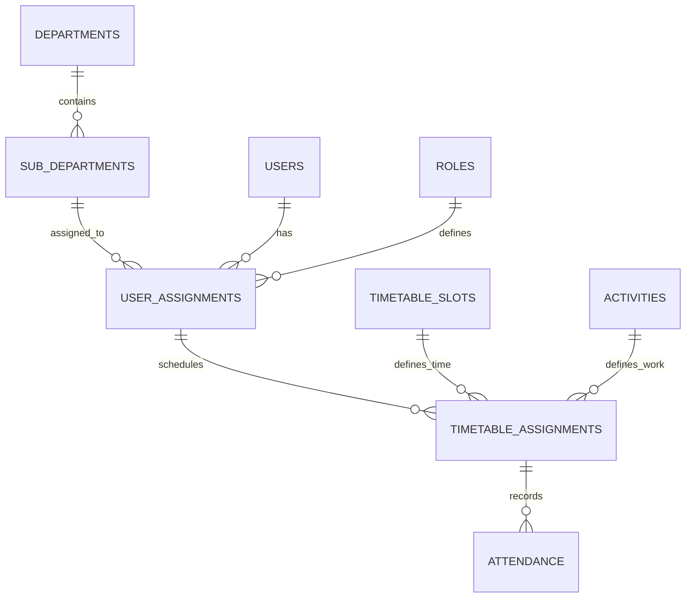

# Migration to SQL Architecture

Migrate the backend storage from Firebase Realtime Database to a structured Relational SQL Database (MySQL/PostgreSQL/SQLite). This allows for complex relationships between departments, specific user roles, and fine-grained timetable and attendance tracking.

## User Review Required

> [!IMPORTANT]
> This is a structural breaking change. Existing Firebase data will not be automatically migrated unless specified. 
> You will need a backend server (e.g., Node.js, PHP, or Python) to host this SQL database for it to be accessible by both the Flutter app and the Web Admin panel.

## Proposed SQL Schema

### Table Definitions

#### 1. Core Structure
- **departments**: `id, name, status, created_at`
- **sub_departments**: `id, name, department_id, created_at`
- **roles**: `id, role_name` (e.g., Teacher, Student, Doctor, Nurse)

#### 2. Users & Assignments
- **users**: `id, full_name, email, phone, designation, password_hash`
- **user_assignments**: `id, user_id, sub_department_id, role_id`
  - *Note: This fulfills "users and roles are department/sub-department specific".*

#### 3. Timetable & Activities
- **timetable_slots**: `id, slot_name, start_time, end_time` (e.g., "9-10", "1st Hour")
- **activities**: `id, name, description` (The work/subject to be assigned)
- **timetable_assignments**: `id, user_assignment_id, slot_id, activity_id, day_of_week`

#### 4. Attendance
- **attendance**: `id, timetable_assignment_id, date, status, present_count, recorded_at`

## Implementation Steps

### [SQL Database Setup]
#### [NEW] [schema.sql](file:///c:/Users/Public/android/presence_tracker/database/schema.sql)
- Generate the DDL script to create the tables and relationships.

### [Flutter App (Presence Tracker)]
#### [MODIFY] [firebase_service.dart](file:///c:/Users/Public/android/presence_tracker/lib/core/services/firebase_service.dart)
- Pivot or replace with `SQLService` or an `ApiService` using `sqflite` for local caching and a REST client for the new SQL backend.

### [Admin Dashboard]
#### [MODIFY] [app.js](file:///c:/Users/Public/android/presence_tracker/admin_dashboard/app.js)
- Replace Firebase SDK initialization and listeners with Fetch API calls to a backend or direct SQL connections if using a tool like PHP/Node.

## Verification Plan

### Automated Tests
- Script to populate mock data into the SQL database.
- Unit tests for Timetable assignment logic (ensuring slots don't overlap).

### Manual Verification
- Verify that adding a user to a specific sub-department correctly restricts their visibility and role scope.
- Confirm Attendance records are correctly linked to the specific Timetable Slot and Activity.
